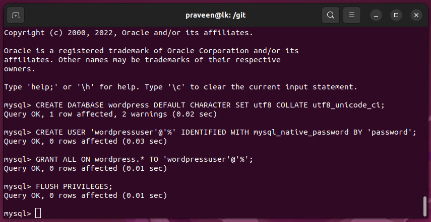
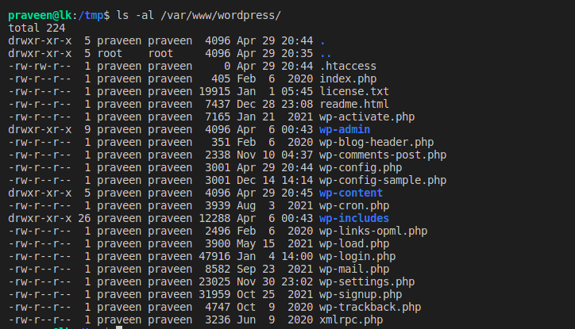

# Ubuntu WordPress LAMP

sudo mysql

CREATE DATABASE wordpress DEFAULT CHARACTER SET utf8 COLLATE utf8_unicode_ci;

CREATE USER 'wordpressuser'@'%' IDENTIFIED WITH mysql_native_password BY 'password';

GRANT ALL ON wordpress.* TO 'wordpressuser'@'%';

FLUSH PRIVILEGES;

EXIT;



# PHP Extensions

sudo apt update

sudo apt install php-curl php-gd php-mbstring php-xml php-xmlrpc php-soap php-intl php-zip

sudo systemctl restart apache2

# wordpress Virtual Host

create a virtual host called 'wordpress'.

# .htaccess Overrides

sudo gedit /etc/apache2/sites-available/wordpress.conf

```
<Directory /var/www/wordpress/>
	AllowOverride All
</Directory>
```

sudo a2enmod rewrite

sudo systemctl restart apache2

# Downloading WordPress

cd /tmp
curl -O https://wordpress.org/latest.tar.gz

tar xzvf latest.tar.gz

touch /tmp/wordpress/.htaccess

cp /tmp/wordpress/wp-config-sample.php /tmp/wordpress/wp-config.php

mkdir /tmp/wordpress/wp-content/upgrade

sudo cp -a /tmp/wordpress/. /var/www/wordpress

